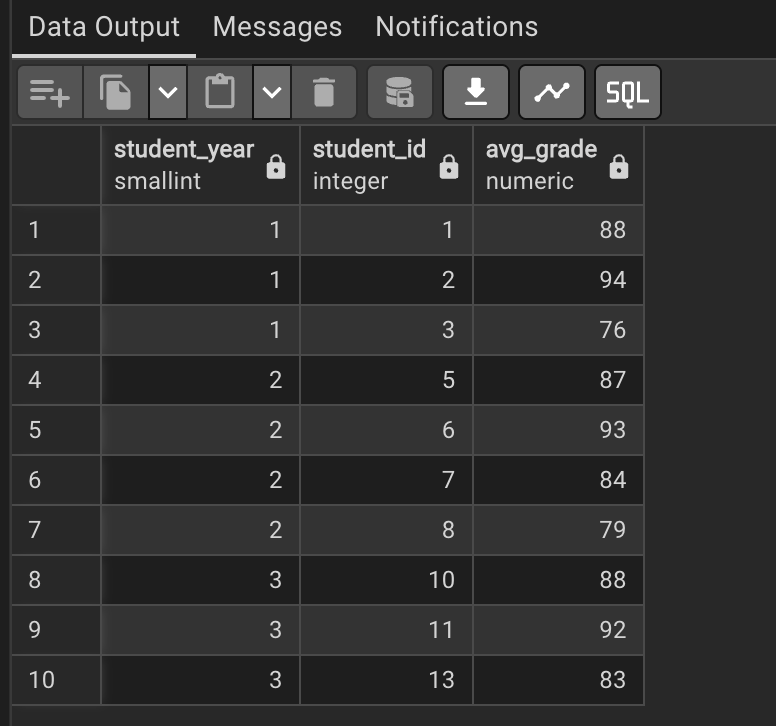
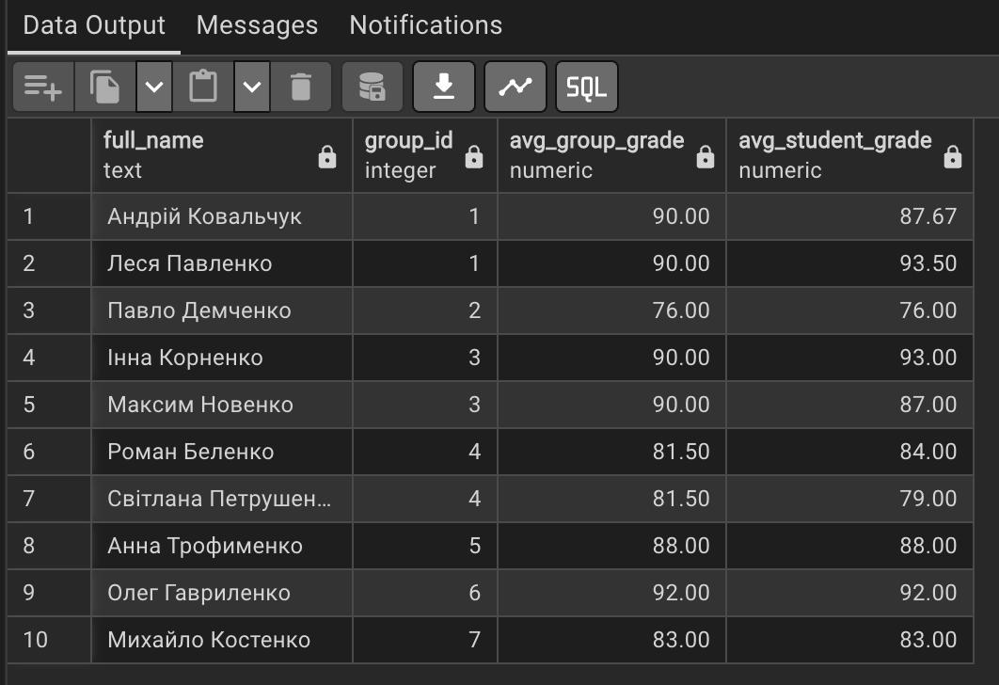
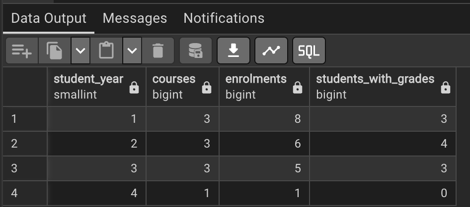
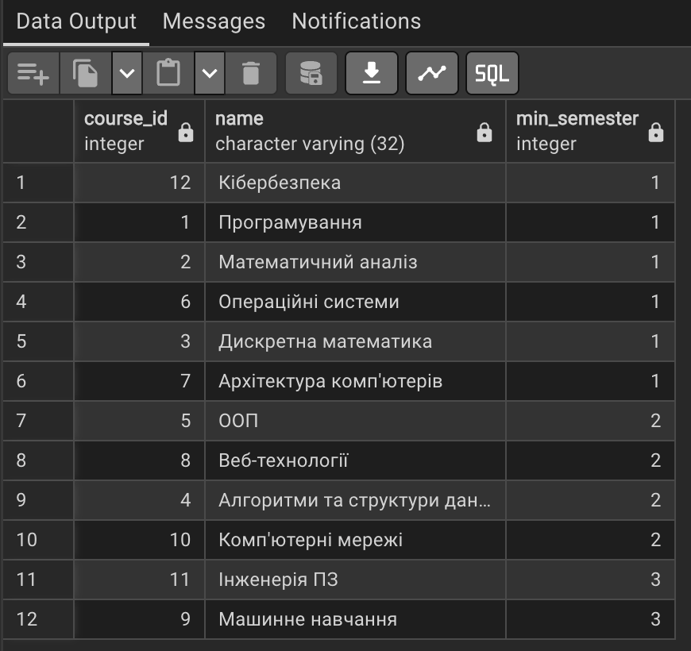
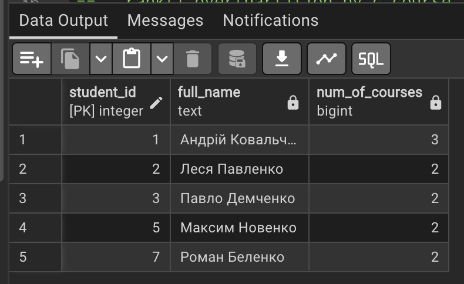
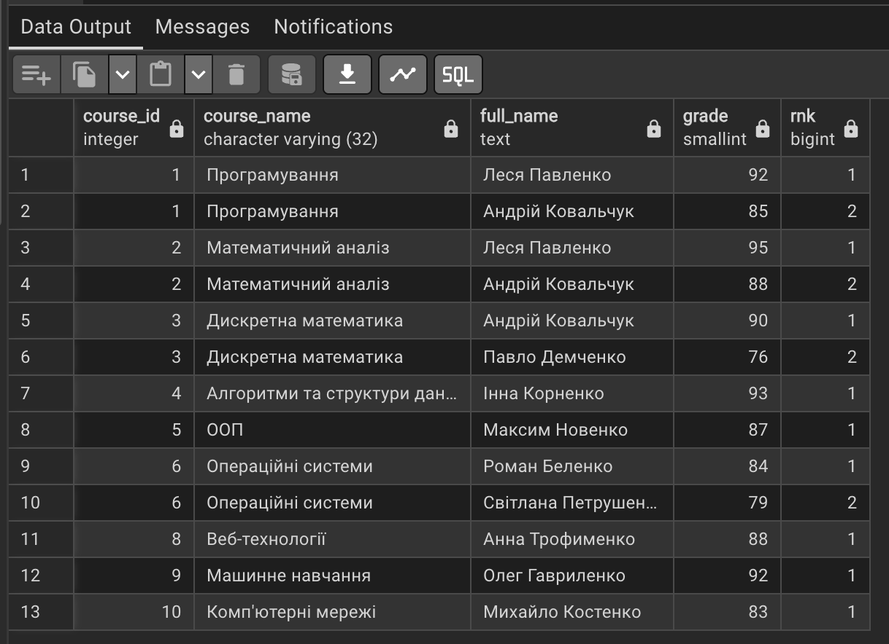

# Порахувати успішність студентів залежно від року навчання

# Для кожного з студентів знайти його середній бал у порівнянні з середнім балом по групі

-- порахувати статистику записів на курси для кожного року навчання:
-- кількість курсів
-- кількість записів
-- кількість студентів, що вже отримали бали

# Для кожного курсу знайти в якому мінімальному семестрі він може читатись

# Знайти всіх студентів, які записані на більше курсів ніж в середньому студенти

# Знайти топ-3 студенти у кожному курсі за отриманими балами

