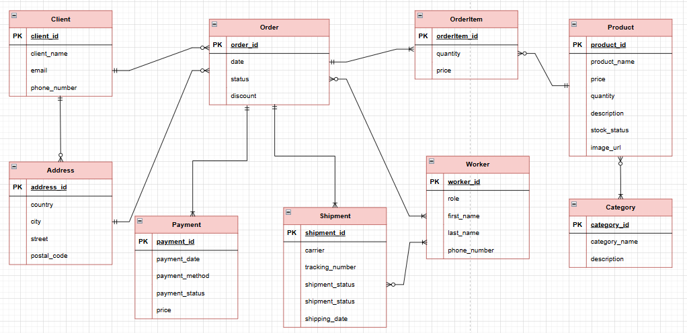

# 1NF

Таблиця перебуває у 1NF, якщо:

- Всі атрибути таблиці є неподільними (містять лише одне
  значення).
- Кожен рядок є унікальним (має РК).
- Порядок рядків у таблиці не важливий.
- Кожна колонка містить значення лише одного типу.

В нашій схемі немає жодних атрибутів типу array та подібних, що можуть вміщати кілька значень одночасно. Кожен рядок є унікальний, таблиця не залежить від порядку рядків, типи даних в одній колонці не порушуються.

# 2NF

Таблиця перебуває у 2NF, якщо:

- Задовільняються всі вимоги 1NF (перебуває в першій нормальній формі).
- Усі неключові атрибути повністю функціонально залежні від первинного ключа.

Наша схема відповідає 2NF:

- Перебуває в 1NF
- Всі атрибути повністю залежать від первинного ключа, композитних ключів в нашій схемі немає

# 3NF

Таблиця перебуває у 3NF, якщо:

- Перебуває у 2NF.
- Відсутні транзитивні залежності - жоден з неключових атрибутів не залежить від іншого неключового атрибуту.

Наша схема відповідає 3NF:

- Перебуває в 2NF
- Залежності існують тільки від первинного ключа

У таблиці Address postal_code залежить від city та country, але для магазину електронної комерції не зручно і не потрібно створювати окрему сутність для відділення postal_code, бо це тільки ускладнить роботу з базою та запис, і ніяк не вплину на зручність роботи з системою.

Схема таблиці:

Функціональні залежності:

